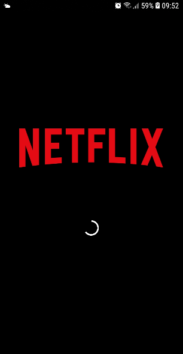
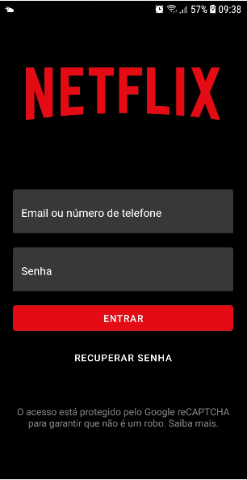
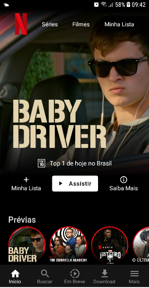
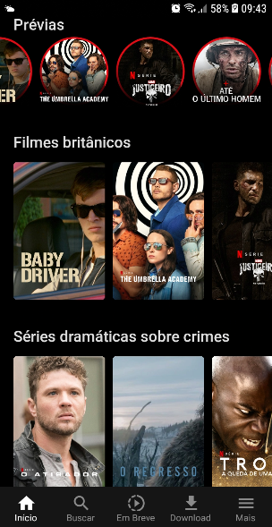
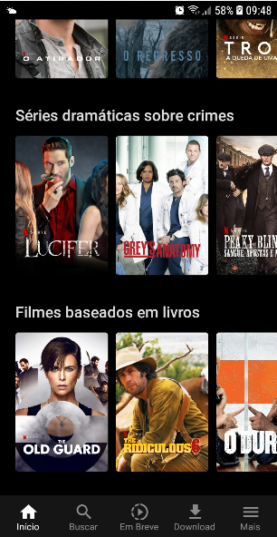
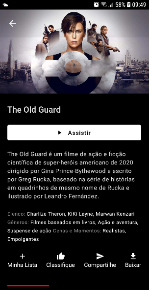
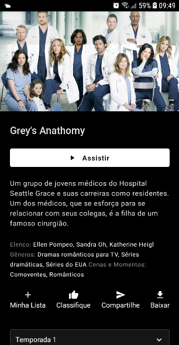
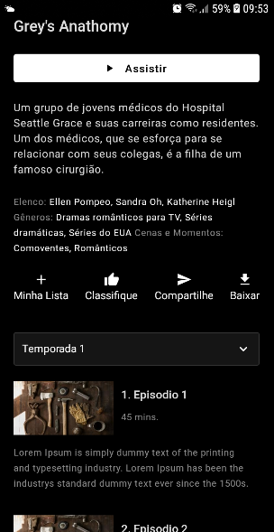

<h1 align="center">
  
</h1>
Uma App em React Native que clona as funcionalidades da NETFLIX

<h2 align="center">Tabela de Conteúdos</h2>

  • <a href="#sobre">Sobre</a>
  • <a href="#funcionalidades">Funcionalidades</a>
  • <a href="#layout">Layout</a>
  • <a href="#tecnologias">Tecnologias</a> 
  • <a href="#status">Status do Projeto</a> 
  • <a href="#autor">Autor</a>
  • <a href="#licenca">Licença</a>

<h2 align="center" id="sobre">Sobre</h2>

Um App que clona  as interfaçes da NETFLIX, dentro dessa aplicação é possível criar usuario, fazer login, fazer refresh para atualizar os filmes e séries que estão sendo exibidos na home, o usuário pode escolher qual fime ou série assistir, escolhendo por cagetoria ou sessão, além de poder navegar entre as telas, também poderá fazer a seleção da temporada ao qual deseja assistir, que será listado os capítulos por tempordas.

<h3 align="left" id="funcionalidades">Funcionalidades</h3>

- [x] Criar cadastro do usuário;
- [x] Fazer login do usário;
- [x] Fazer refresh de conteúdos na página home e nas categorias;
- [x] Selecionar filmes ou séries;
- [x] Selecionar capitos das séries por temporadas;
- [x] Fazer reset de senha (ainda falta implementar);
- [x] Fazer logout (ainda falta implementar);

<h2 align="left" id="layout">🎨 Layout Mobile</h2>

  
  

  
  

  
  

  
  

<h3 align="left" id="tecnologias">🛠 Tecnologias</h3>

As seguintes Tecnologias e bibliotecas que foram usadas na construção do projeto

- [Node.js](https://nodejs.org/en/)
- [React](https://pt-br.reactjs.org/)
- [React Native](https://reactnative.dev/)
- [Async Storage](https://react-native-async-storage.github.io/async-storage/docs/install)
- [styled-components](https://styled-components.com/docs/basics)
- [react-navigation/native](https://reactnavigation.org/docs/getting-started/)
- [react-navigation/bottom-tabs](https://reactnavigation.org/docs/bottom-tab-navigator/)
- [react-navigation/native-stack](https://reactnavigation.org/docs/native-stack-navigator/)
- [react-native-svg](https://github.com/react-native-svg/react-native-svg)
- [react-native-svg-transformer](https://github.com/kristerkari/react-native-svg-transformer)
- [react-native-paper](https://callstack.github.io/react-native-paper/getting-started.html)
- [react-native-vector-icons](https://github.com/oblador/react-native-vector-icons)
- [rectt-native-linear-gradient](https://github.com/react-native-linear-gradient/react-native-linear-gradient)
- [axios](https://axios-http.com/docs/intro)

<h2 align="left" id="status">Status do Projeto</h2>

 🚧  React Native 🚀 Versão 1.0 em construção.  🚧.

<h2 align="left" id="autor">🦸 Autor</h2>
<a href="https://github.com/JailsonSantos">
 
  
 <b>Jailson Santos</b></a> <a href="https://www.linkedin.com/in/jailson-santos-726395104/" title="Jailson Santos">🚀</a>
  

 

<h2 align="left" id="licenca">📝 Licença</h2>

Este projeto esta sobe a licença [MIT](./LICENSE).

Feito com ❤️ por Jailson Santos 👋🏽 [Entre em contato!](https://www.linkedin.com/in/jailson-santos-726395104/)
